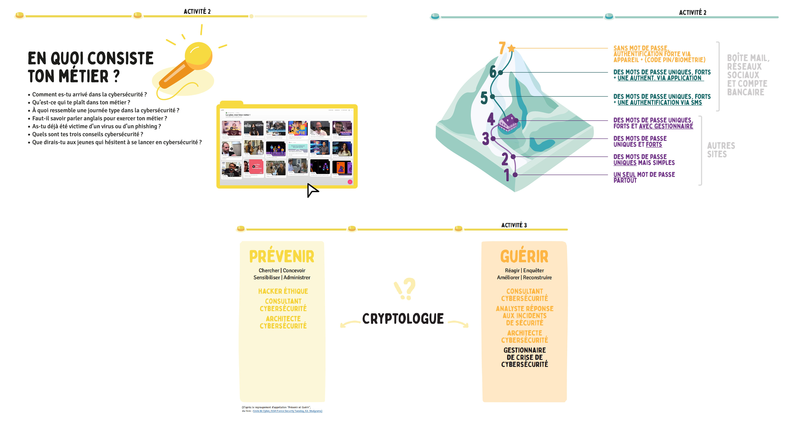
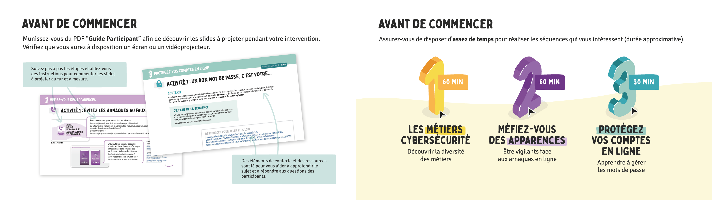

# La Cybersécurité, mon futur métier !
__"La cybersécurité, mon futur métier"__ est un kit pédagogique qui a été élaboré par des professionnels de la cybersécurité, afin de permettre aux jeunes (15 à 21 ans) de mieux comprendre les enjeux de la cybersécurité et de découvrir les métiers qui y sont associés.

Les séquences sont indépendantes les unes des autres et peuvent être réalisées pour une intervention allant d’__une heure à une demi-journée__. 

Le kit peut être utilisé par des enseignants, pour des élèves __en fin de collège comme au lycée__ ou bien par des professionnels de la cybersécurité à l’occasion d'échanges sur des forums et de salons.

# Comment utiliser ce kit pédagogique ?

Simple à utiliser, le kit pédagogique est constitué :
- [D'un guide Participant (PDF)](https://github.com/microsoft/Cybersecurity-jobs-skills-workshop/raw/main/doc/kit/FR/PDF/GUIDE_CYBER_PARTICIPANT_v1.pdf) 

  

- [D'un guide Intervenant (PDF)](https://github.com/microsoft/Cybersecurity-jobs-skills-workshop/raw/main/doc/kit/FR/PDF/GUIDE_CYBER_INTERVENANT_v1.pdf) 

  

Les fichiers sont également disponibles au format PPTX :
- [Guide Participant (PPTX)](https://view.officeapps.live.com/op/view.aspx?src=https%3A%2F%2Fraw.githubusercontent.com%2Fmicrosoft%2FCybersecurity-jobs-skills-workshop%2Fmain%2Fdoc%2Fkit%2FFR%2FPPTX%2FGUIDE_CYBER_PARTICIPANT_v1.pptx)
- [Guide Intervenant (PPTX)](https://view.officeapps.live.com/op/view.aspx?src=https%3A%2F%2Fraw.githubusercontent.com%2Fmicrosoft%2FCybersecurity-jobs-skills-workshop%2Fmain%2Fdoc%2Fkit%2FFR%2FPPTX%2FGUIDE_CYBER_INTERVENANT_v1.pptx)

# Pourquoi ce kit ?

La cybersécurité est un enjeu majeur. Aujourd'hui, les entreprises et les particuliers sont de plus en plus exposés aux cyberattaques. __La pénurie de talents dans le domaine de la cybersécurité est également un véritable problème.__ 

En France, il y a actuellement __15 000 postes à pourvoir__ dans le domaine de la cybersécurité. Globalement, plusieurs millions de postes dans le monde restent sans candidats. La filière de la cybersécurité est encore méconnue et n'attire pas assez de talents. 

Pour inciter le plus grand nombre à entreprendre une carrière dans la cybersécurité, __il faut susciter des vocations.__ “Les étudiants ne peuvent pas être ce qu'ils ne connaissent pas”. Les jeunes doivent pouvoir découvrir que la cybersécurité est à la portée de tous et qu'il y a une place pour eux dans ce secteur. Il est important qu’ils prennent conscience qu'il s'agit d'un __domaine d'avenir__, porteur de __sens__ et tourné vers __la protection numérique de tous__.

# Pour contribuer

Le kit __“La cybersécurité, mon futur métier”__ est mis à disposition sous licence __Creative Commons Attribution 4.0 International - (CC BY 4.0)__. Vous pouvez l'utiliser et le modifier tant que les conditions de la [licence](LICENSE) sont respectées.